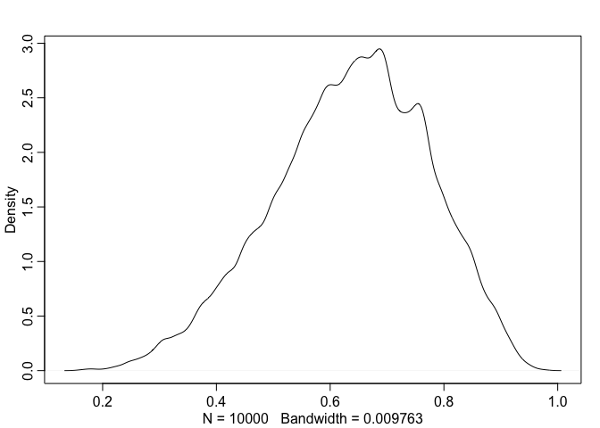
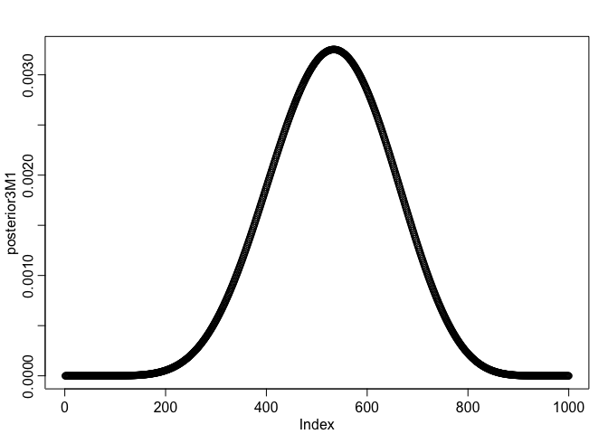
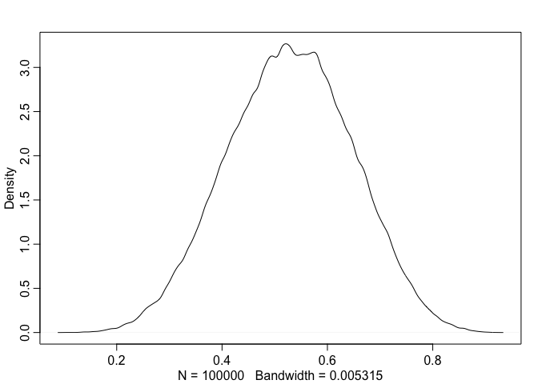

# Statistical Rethinking Chapter 3 problems
Name: Kazunari Nozue
## R code 3.27 # see R code 2.3 for details

```r
p_grid<-seq(from=0,to=1,length.out=1000)
prior <- rep(1,1000 )
likelihood <- dbinom( 6 , size=9 , prob=p_grid )
posterior <- likelihood * prior
posterior <- posterior / sum(posterior)
set.seed(100)
samples <- sample( p_grid , prob=posterior , size=1e4 , replace=TRUE ) # draw 1e4 samples from posterior
## 3E1: How much posterior probability lies below p=0.2?
library(rethinking)
```

```
## Loading required package: rstan
```

```
## Warning: package 'rstan' was built under R version 3.2.3
```

```
## Loading required package: ggplot2
```

```
## Warning: package 'ggplot2' was built under R version 3.2.3
```

```
## rstan (Version 2.9.0-3, packaged: 2016-02-11 15:54:41 UTC, GitRev: 05c3d0058b6a)
```

```
## For execution on a local, multicore CPU with excess RAM we recommend calling
## rstan_options(auto_write = TRUE)
## options(mc.cores = parallel::detectCores())
```

```
## Loading required package: parallel
```

```
## rethinking (Version 1.58)
```

```r
dens(samples)
```



```r
sum(samples[samples<0.2])/1e4 # divide the resulting count by the total number of samples
```

```
## [1] 8.778779e-05
```

```r
# 8.778779e-05
## 3E2: How much posterior probability lies above p=0.8?
sum(samples[samples>0.8])/1e4 # divide the resulting count by the total number of samples
```

```
## [1] 0.09482282
```

```r
# 0.09482282
## 3E3: How much posterior probability lies between p=0.2 and p=0.8?
sum(samples[samples>0.2 & samples<0.8]) /1e4
```

```
## [1] 0.5400596
```

```r
# 0.5400596
## 3E4. 20% of the posterior proability lies below which value of p?
quantile(samples,0.2) # 0.5195195
```

```
##       20% 
## 0.5195195
```

```r
## 3E5. 20% of the posterior probability lies above which value of p? 
quantile(samples,1-0.2) # 0.7567568
```

```
##       80% 
## 0.7567568
```

```r
## 3E6. Which values of p contain the narrowest interval equal to 66% of the posterior probability?
HPDI(samples,prob=0.66) # between 0.5205205 and 0.7847848. Highest Posterior Density Intervals (HPDI) are calculated by HPDinterval in the coda package (from help file)
```

```
##     |0.66     0.66| 
## 0.5205205 0.7847848
```

```r
## 3E7. Which values of p contain 66% of the posterior probability, assuming equal posterior probability both below and above the interval?
PI(samples,prob=0.66) #0.5005005 and 0.7687688. Percentile intervals (PI) use quantile and assign equal mass to each tail (from help file).
```

```
##       17%       83% 
## 0.5005005 0.7687688
```

```r
## 3M1. Suppose the globe tossing data had turned out to be 8 water in 15 tosses. Construct the posterior distribution, using grid approximation. Use the same flat prior as before.
p_grid<-seq(from=0,to=1,length.out=1000)
prior <- rep(1,1000 ) # flat prior
likelihood3M1 <- dbinom(8 , size=15 , prob=p_grid )
posterior3M1 <- likelihood3M1 * prior
posterior3M1 <- posterior3M1 / sum(posterior3M1)
plot(posterior3M1)
```



```r
## 3M2. Draw 10,000 samples from the grid approximation from above. Then use the samples to calculate the 90% HPDI for p.
samples2 <- sample( p_grid , prob=posterior3M1 , size=1e5 , replace=TRUE ) # draw 1e5 samples from posterior
dens(samples2)
```



```r
HPDI(samples2,prob=0.9) # 0.3343343 and 0.7217217
```

```
##      |0.9      0.9| 
## 0.3323323 0.7207207
```

```r
#STOP AFTER 3M2 FOR 02/25 ASSIGNMENT_
```
## 3M3

## 3M4

## 3M5

## 3H1

## 3H2

## 3H3

## 3H4

## 3H5
